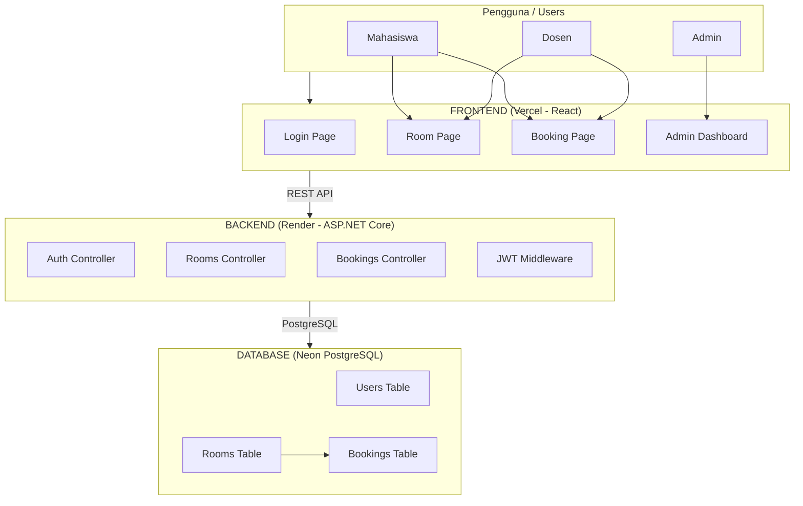
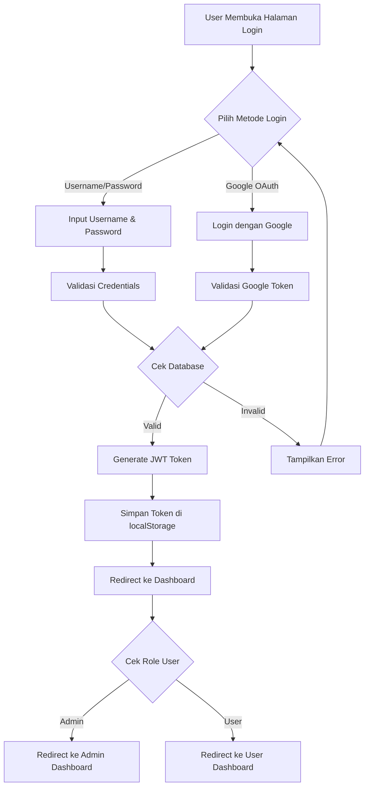
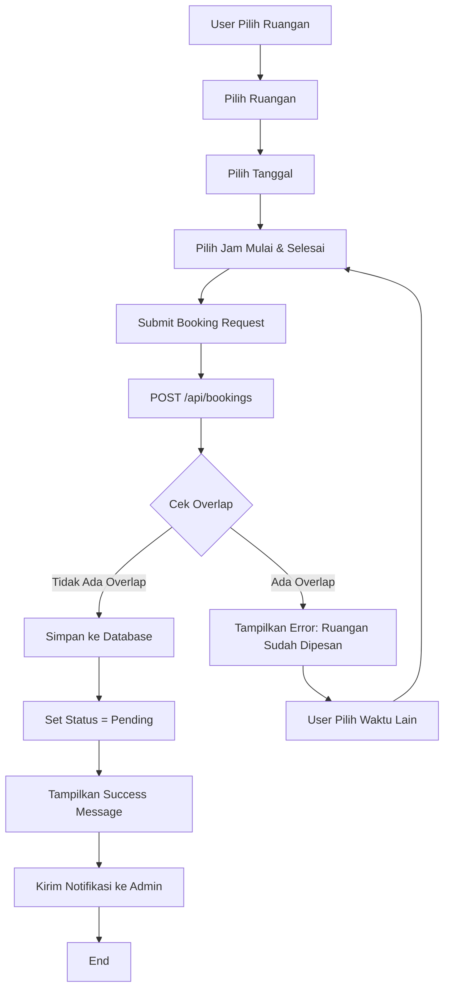
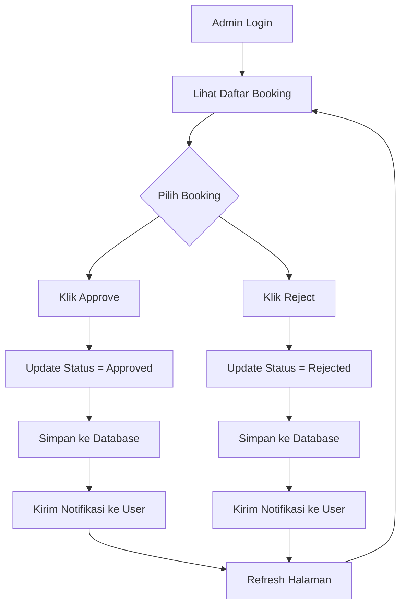
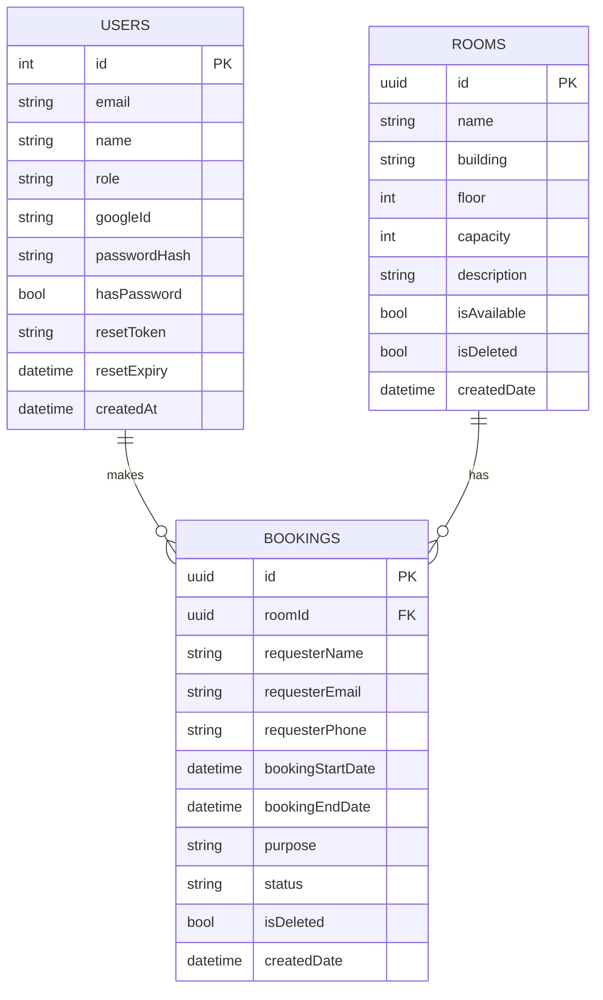
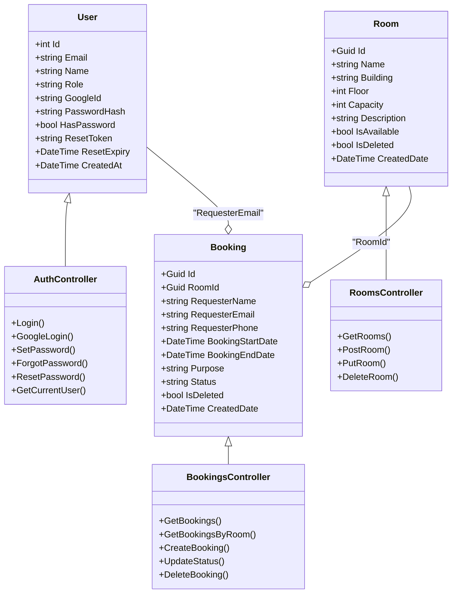
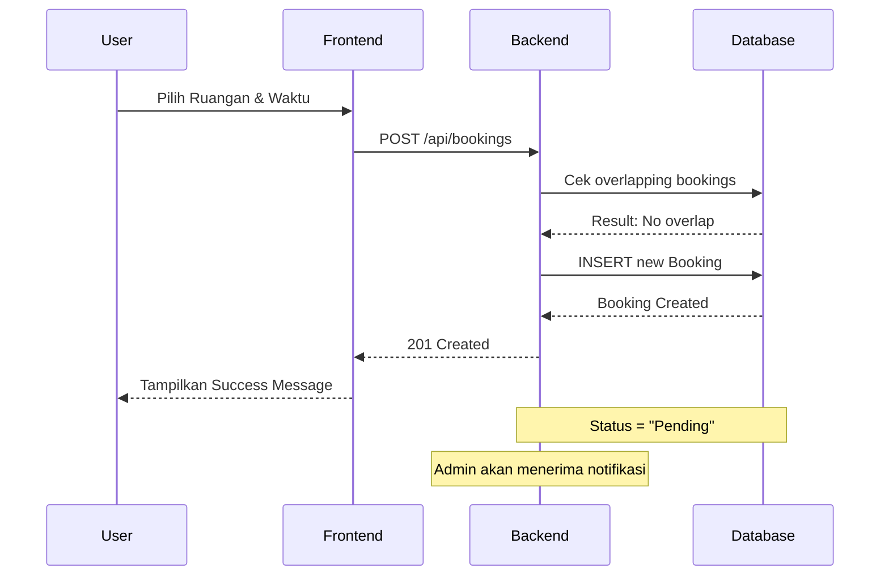
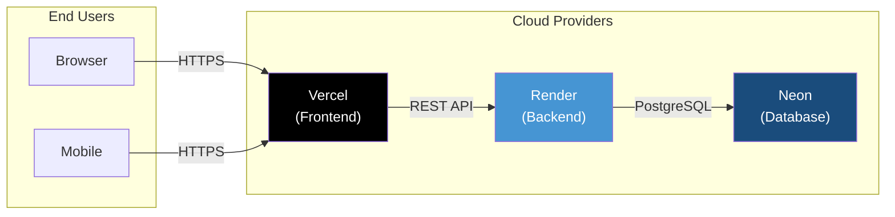

# Arsitektur Sistem SPARK-PENS

## Gambaran Umum

SPARK-PENS adalah sistem peminjaman ruangan berbasis web yang dibangun untuk Politeknik Elektronika Negeri Surabaya (PENS). Sistem ini memungkinkan mahasiswa, dosen, dan admin untuk memesan ruangan secara online.

## Mermaid Diagrams

Anda dapat melihat diagram ini secara interaktif di: https://mermaid.live

### 1. Arsitektur Sistem Keseluruhan

### 2. Flowchart Login

### 3. Flowchart Peminjaman Ruangan

### 4. Flowchart Persetujuan Admin

### 5. Entity Relationship Diagram

### 6. Arsitektur Components (Class Diagram)

### 7. Sequence Diagram - Create Booking

### 8. Deployment Architecture

### 9. API Endpoints Overview

```mermaid
flowchart TB
    subgraph API["SPARK-PENS API"]
        subgraph AuthAPI["Auth Endpoints"]
            A1["POST /api/auth/login"]
            A2["POST /api/auth/google"]
            A3["POST /api/auth/set-password"]
            A4["POST /api/auth/forgot-password"]
            A5["POST /api/auth/reset-password"]
            A6["GET /api/auth/me"]
        end

        subgraph RoomsAPI["Rooms Endpoints"]
            R1["GET /api/rooms"]
            R2["POST /api/rooms"]
            R3["PUT /api/rooms/{id}"]
            R4["DELETE /api/rooms/{id}"]
        end

        subgraph BookingsAPI["Bookings Endpoints"]
            B1["GET /api/bookings"]
            B2["GET /api/bookings/room/{id}"]
            B3["POST /api/bookings"]
            B4["PATCH /api/bookings/{id}/status"]
            B5["DELETE /api/bookings/{id}"]
        end
    end

    Public["Public"] -.-> R1
    Public -.-> B2
    Public -.-> B3
    Public -.-> A1
    Public -.-> A2

    Auth["Authenticated"] -.-> R2
    Auth -.-> R3
    Auth -.-> R4
    Auth -.-> B1
    Auth -.-> B4
    Auth -.-> B5
    Auth -.-> A6

    style Public fill:#90EE90
    style Auth fill:#FFB6C1
```

## Cara Melihat Diagram

1. **Online (Mermaid Live):**
   - Buka https://mermaid.live
   - Copy kode Mermaid dari file ini
   - Paste di editor kiri
   - Diagram akan di-render secara otomatis

2. **VS Code:**
   - Install extension "Markdown Preview Mermaid Support"
   - Buka file ini di VS Code
   - Klik "Preview" untuk melihat diagram

3. **GitHub/GitLab:**
   - Kedua platform mendukung Mermaid di Markdown
   - Diagram akan di-render otomatis di README

## Link Referensi

- [Mermaid Live Editor](https://mermaid.live)
- [Mermaid Documentation](https://mermaid.js.org/intro/)
- [Mermaid Cheat Sheet](https://mermaid.js.org/intro/cheat-sheet.html)
